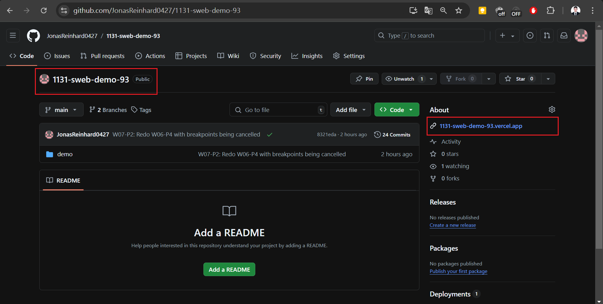
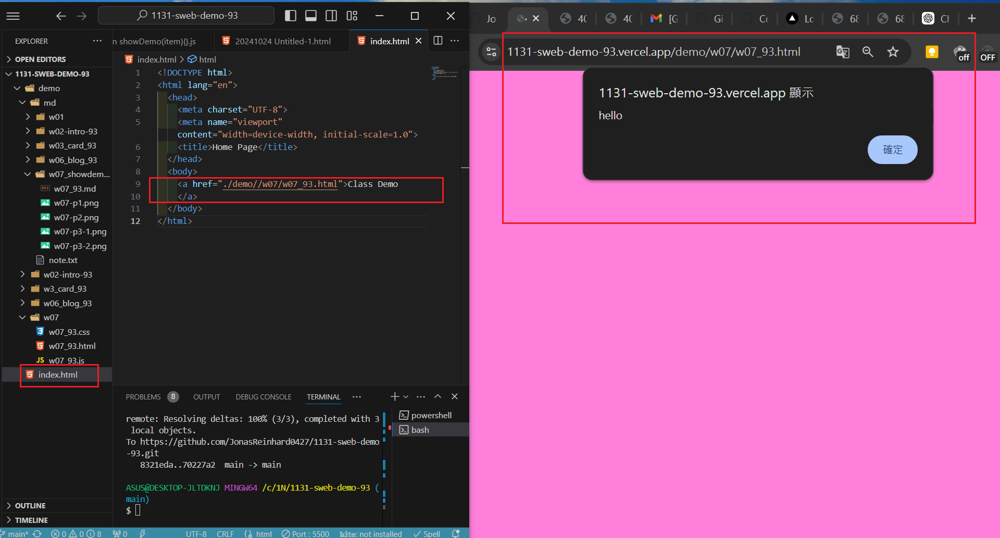

[My Github URL](https://github.com/JonasReinhard0427/1131-sweb-demo-93)

[My Vercel URL](https://1131-sweb-demo-93.vercel.app/)


### W07-P1: Test css and js for w07_93.html


```
000b49f JonasReinhard0427       Sat Oct 26 16:59:26 2024 +0800  W07-P1: Test css and js for w07_93.html
```

### W07-P2: Redo W06-P4 with breakpoints being cancelled


```
8321eda JonasReinhard0427       Sat Oct 26 21:55:22 2024 +0800  W07-P2: Redo W06-P4 with breakpoints being cancelled
```

### W07-P3: Connect your Github repo to Vercel and have a root home page to class demo navigation

#### = > In Vercel, show w06 blogs demo


#### = > Show your Github repo with Vercel URL

[My Vercel URL](https://1131-sweb-demo-93.vercel.app/)



#### = > create  index.html as root home page and have a link to class demo navigation as done in w07



```
f949d4a JonasReinhard0427       Sun Oct 27 01:04:26 2024 +0800  W07-P3: Connect your Github repo to Vercel and have a root home page to class demo navigation
```


### W07-P4: Create navbar with links to class demo w02, w03, w06, and deploy it to Vercel

#### => local 

![w07-p4-1.png]

#### => Vercel

![w07-p4-2.png]
```
```