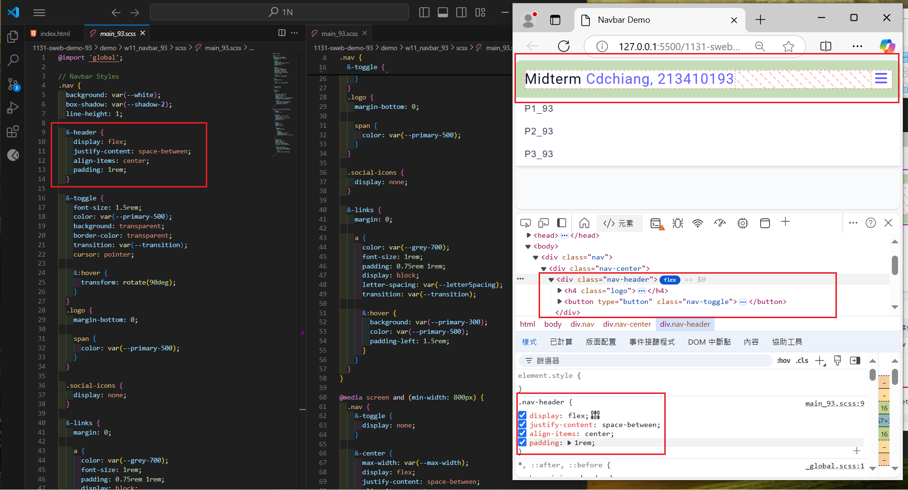

[My Github URL](https://github.com/JonasReinhard0427/1131-sweb-demo-93)

[My Vercel URL](https://1131-sweb-demo-93.vercel.app/)

### W11-P1: Create html code for navbar


```
27b01c5 cdchiang        Sat Nov 23 18:51:55 2024 +0800  W11-P1: Create html code for navbar
```

### W11-P2: Use sass to convert scss/main_93.scss to css/main_93.css


```
e599320 cdchiang        Sat Nov 23 22:25:07 2024 +0800  W11-P2: Use sass to convert scss/main_93.scss to css/main_93.css
```

### W11-P3: scss for small screen

```
1af8c7d cdchiang        Sat Nov 23 23:42:51 2024 +0800  W11-P3: scss for small screen
```



### W11-P4: css for larger screen


### W11-P5: git logs for W11

```

```
