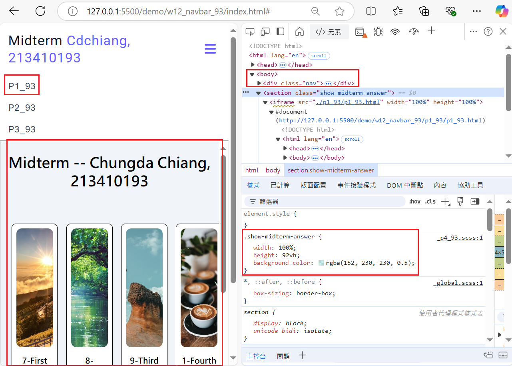
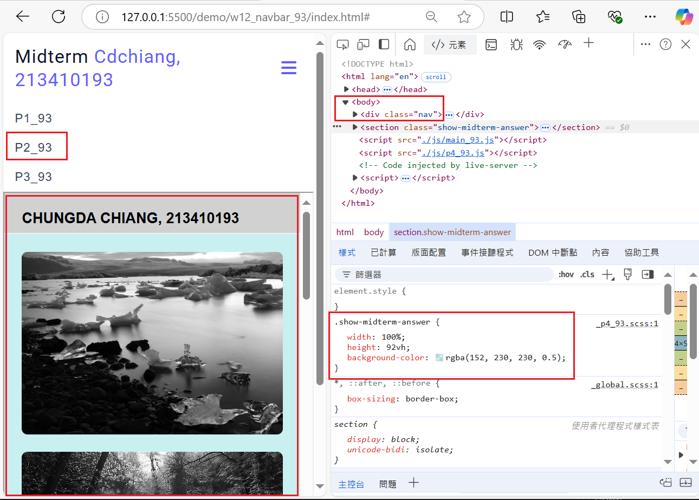
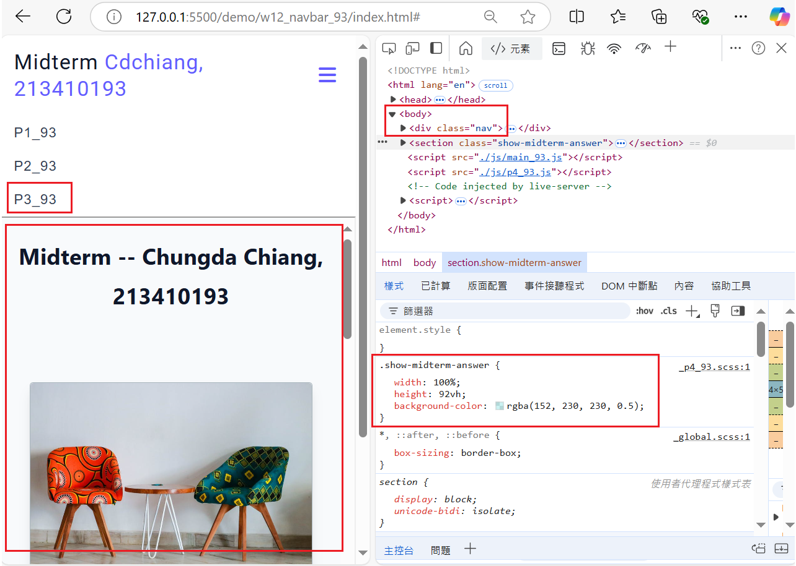

[My Github URL](https://github.com/JonasReinhard0427/1131-sweb-demo-93)

[My Vercel URL](https://1131-sweb-demo-93.vercel.app/)

### W12-P1: Show answer of p1_93, p2_93, p3_93 in midterm exam
 
#### => show p1_93
 

 

 
#### => show p2_93
 

 

 
#### => show p3_93
 

 

 
```
9753aa9 cdchiang        Fri Nov 29 21:33:12 2024 +0800  W12-P1: Show answer of p1_93, p2_93, p3_93 in midterm exam
```

### W12-P2: Embed p1_93, p2_93, p3_93 content into index.html, and make it to work correctly
 
#### => select p3_93 nav link, navbar-fixed will be displayed
 

 
#### => select p1_93 nav link, navbar-fixed will be removed
 

 
#### => select p2_93 nav link, navbar-fixed will be displayed
 

 
```
1e2a5e0 cdchiang        Sat Nov 30 15:00:43 2024 +0800  W12-P2: Embed p1_93, p2_93, p3_93 content into index.html, and make it to work correctly
```

### W12-P3: git log for w12

