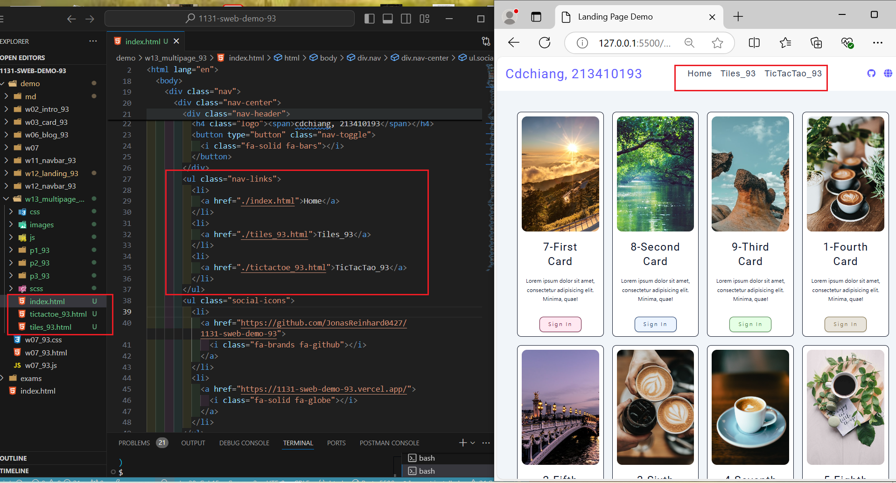
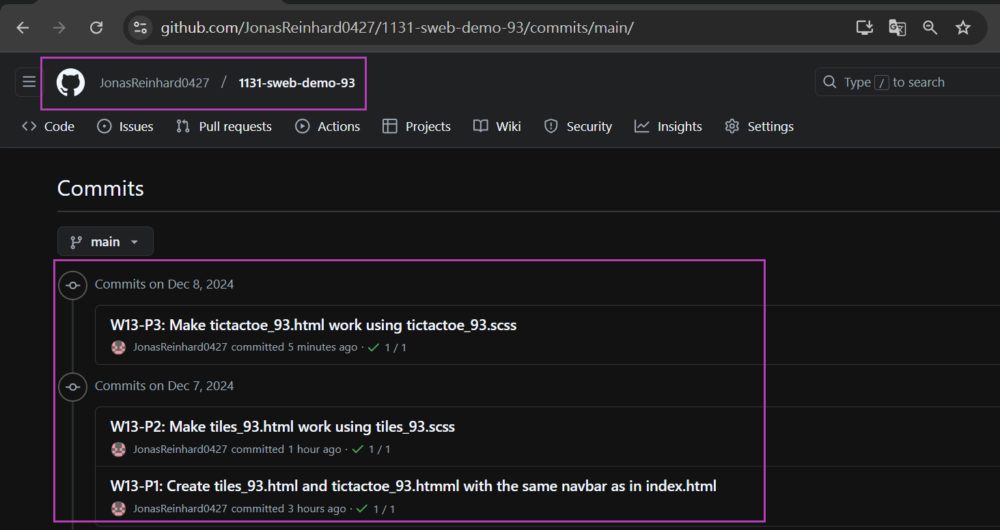

[My Github URL](https://github.com/JonasReinhard0427/1131-sweb-demo-93)

[My Vercel URL](https://1131-sweb-demo-93.vercel.app/)

### W13-P1: Create tiles_93.html and tictactoe_93.htmml with the same navbar as in index.html
 
#### => show p1_93
 

 

```
a171867 cdchiang        Sat Dec 7 21:03:30 2024 +0800   W13-P1: Create tiles_93.html and tictactoe_93.htmml with the same navbar as in index.html
```

### W13-P2: Make tiles_93.html work using tiles_93.scss
 


```

```

### W13-P3: Make tictactoe_93.html work using tictactoe_93.scss

