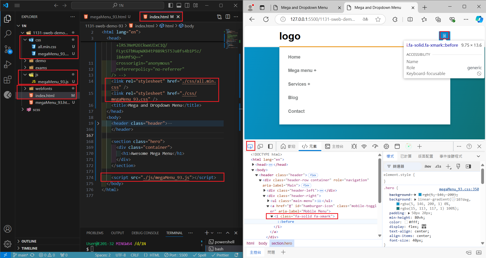
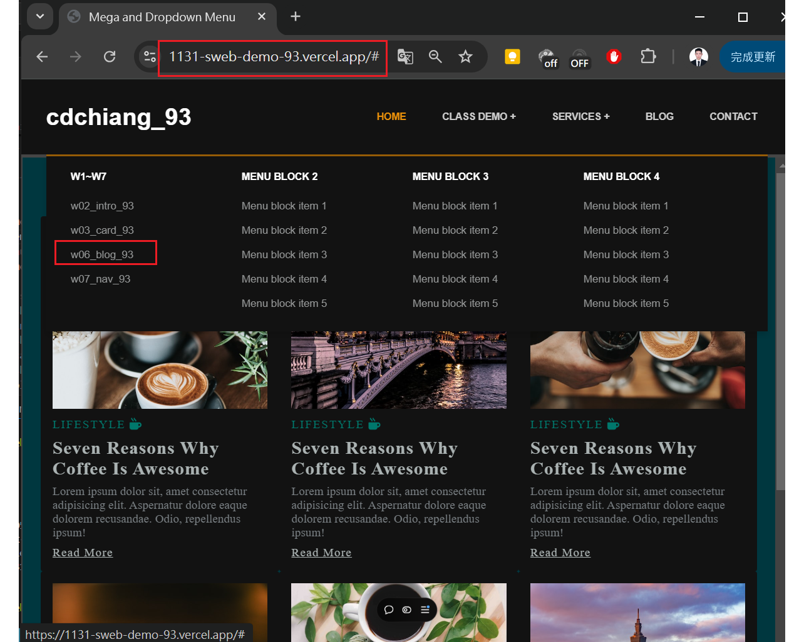

[My Github URL](https://github.com/JonasReinhard0427/1131-sweb-demo-93)

[My Vercel URL](https://1131-sweb-demo-93.vercel.app/)

### W14-P1: Setup mega menu to replace index.html in the home directory

#### => Show in local



#### => Show in Vercel


```
b8aa3a4 cdchiang        Thu Dec 12 21:42:36 2024 +0800  update photos of w14 p1
b02deb6 cdchiang        Thu Dec 12 21:34:36 2024 +0800  renew index.html
bf1f934 cdchiang        Thu Dec 12 21:20:12 2024 +0800  W14-P1: Setup mega menu to replace index.html in the home directory
```

### W14-P2: Show class demo of w2, w3, w6 in both local and Vercel

#### => Show in local for w2


#### => Show in local for w3


#### => Show in Vercel for w6



```

```

### W14-P3: Add tictactoe multipage

#### => Show in local


#### => Show in Vercel


```

```
