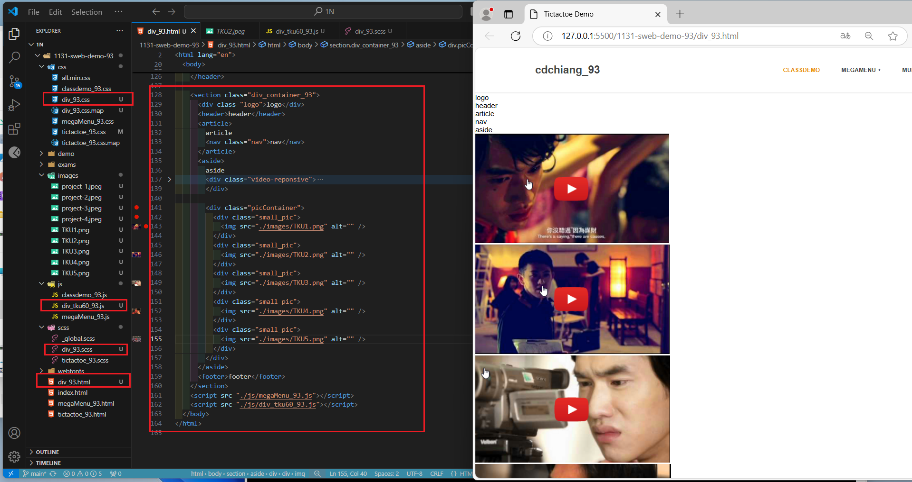
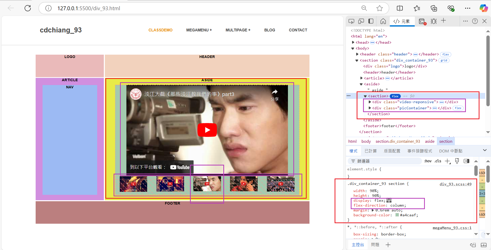
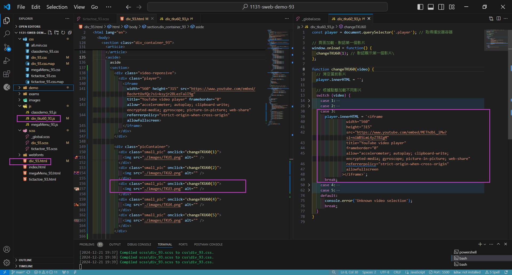
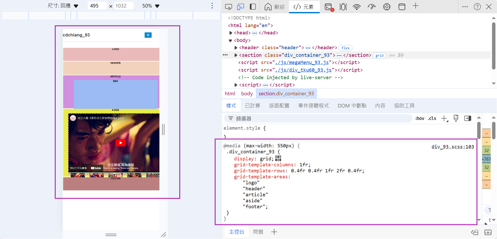
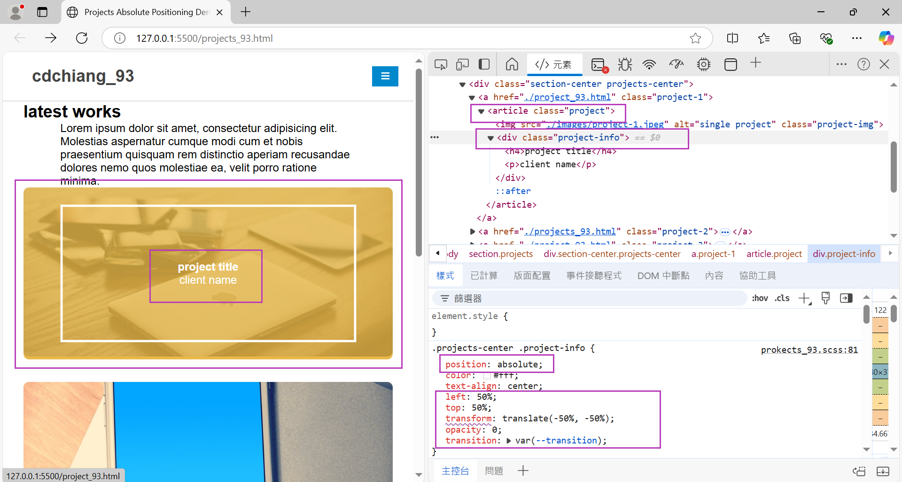
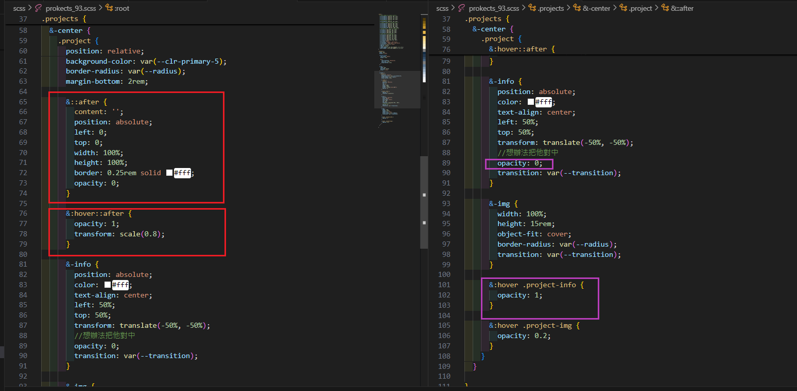
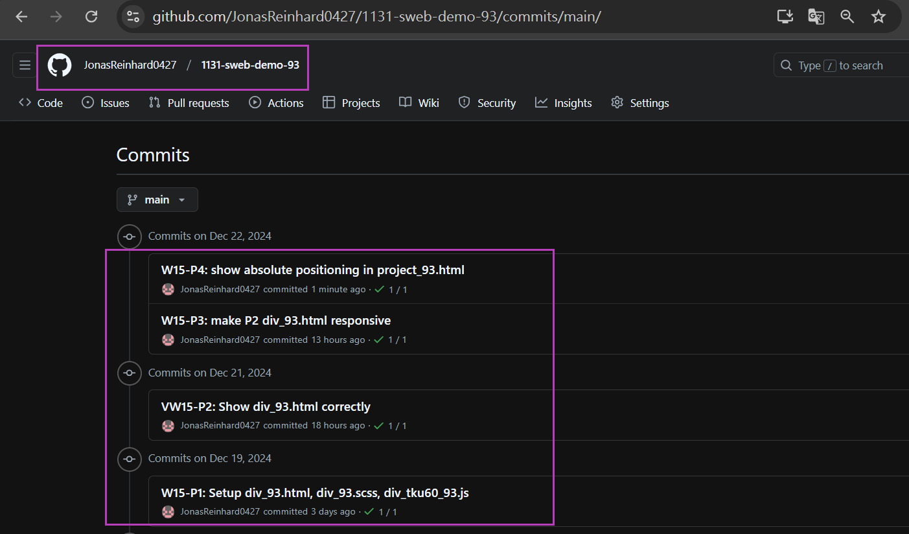

[My Github URL](https://github.com/JonasReinhard0427/1131-sweb-demo-93)

[My Vercel URL](https://1131-sweb-demo-93.vercel.app/)

### Video: W15-P1: Setup div_93.html, div_93.scss, div_tku60_93.js



```

```

### Video: W15-P2: Show div_93.html correctly

#### => select tku60 pic 3, and show relevant youtube video



#### => html, and js code for showing video 3



```

```

### Video: W15-P3: make P2 div_93.html responsive



```

```

### Video: W15-P4: show absolute positioning in project_93.html





```

```

### W15-P5: git log for w15


