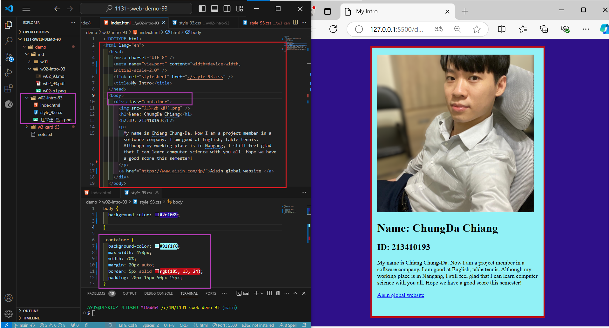

[My Github URL](https://github.com/JonasReinhard0427/1131-sweb-demo-93)


### W02-P1: Collaborate with your Github repo htchung@gms.tku.edu.tw and sian-0018 (TA) 


```
838dc24 cdchiang        Wed Sep 25 00:40:40 2024 +0800  W02-P1: Collaborate with your Github repo htchung@gms.tku.edu.tw and sian-0018 (TA)
```


### W02-P2: My Introduction using html with css selector (container)


```
bb9c6af cdchiang        Fri Sep 27 01:04:58 2024 +0800  W02-P2: My Introduction using html with css selector (container)
```

### W02-P3: git logs of W2
```
bb9c6af cdchiang        Fri Sep 27 01:04:58 2024 +0800  W02-P2: My Introduction using html with css selector (container)
01befe9 cdchiang        Thu Sep 26 00:30:16 2024 +0800  202409260030
838dc24 cdchiang        Wed Sep 25 00:40:40 2024 +0800  W02-P1: Collaborate with your Github repo htchung@gms.tku.edu.tw and sian-0018 (TA)
53b0093 cdchiang        Wed Sep 25 00:39:57 2024 +0800  W02-P1: Collaborate with your Github repo htchung@gms.tku.edu.tw and sian-0018 (TA)
61e6c47 cdchiang        Tue Sep 24 01:15:20 2024 +0800  20240923
45dd3fa JonasReinhard0427       Thu Sep 19 21:08:46 2024 +0800  w02
```