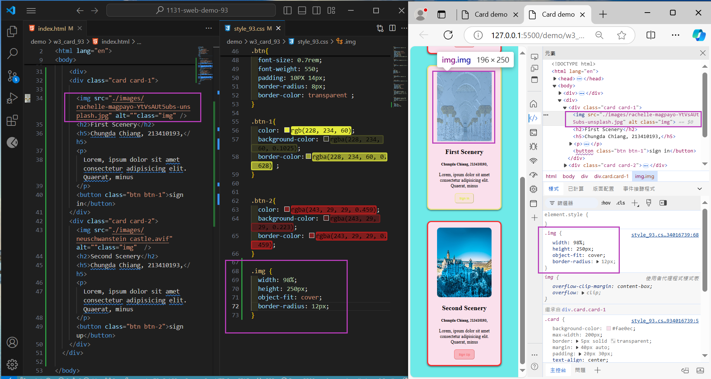

[My Github URL](https://github.com/JonasReinhard0427/1131-sweb-demo-93)


### W03-P1: Show first card and change icon color using DevTools


```
c3a35b6 cdchiang        Wed Oct 2 16:26:57 2024 +0800   W03-P1: Show first card and change icon color using DevTools
```


### W03-P2: Show btn and btn-1 class selector in DevTools compare to that in HTML and CSS


```
a7566b7 cdchiang        Wed Oct 2 20:27:32 2024 +0800   w03-P2: Show btn and btn-1 class selector in DevTools compare to that in HTML and CSS
```

### W03-P3: Show 2 photos with the same height, remain photo ration, and show .img class selector



```
9e01cfd cdchiang        Thu Oct 3 13:54:58 2024 +0800   W03-P3: Show 2 photos with the same height, remain photo ration, and show .img class selector

```


### W03-P4: git logs of W3
```
9e01cfd cdchiang        Thu Oct 3 13:54:58 2024 +0800   W03-P3: Show 2 photos with the same height, remain photo ration, and show .img class selector
a7566b7 cdchiang        Wed Oct 2 20:27:32 2024 +0800   w03-P2: Show btn and btn-1 class selector in DevTools compare to that in HTML and CSS   
ebd4d4d cdchiang        Wed Oct 2 16:30:39 2024 +0800   20241002V1
c3a35b6 cdchiang        Wed Oct 2 16:26:57 2024 +0800   W03-P1: Show first card and change icon color using DevTools
```