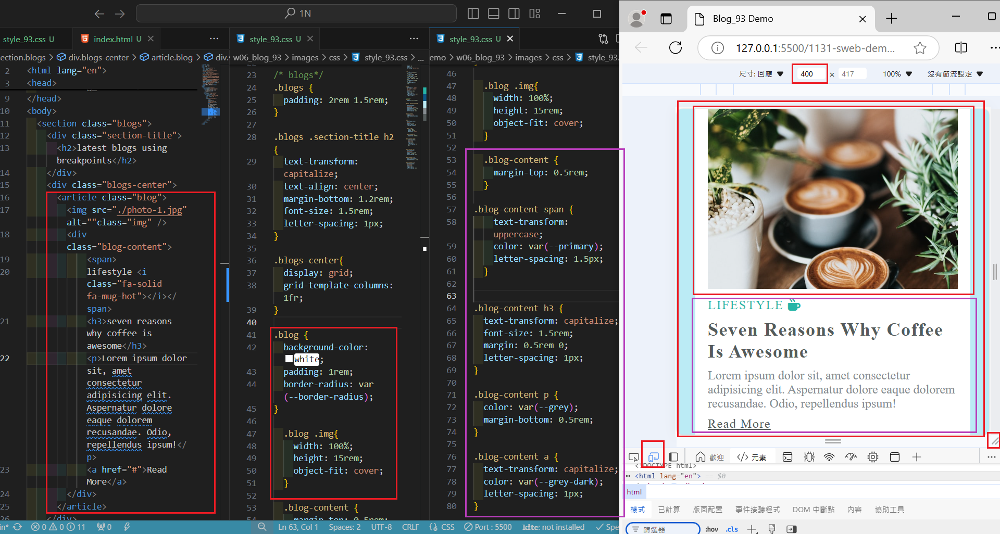
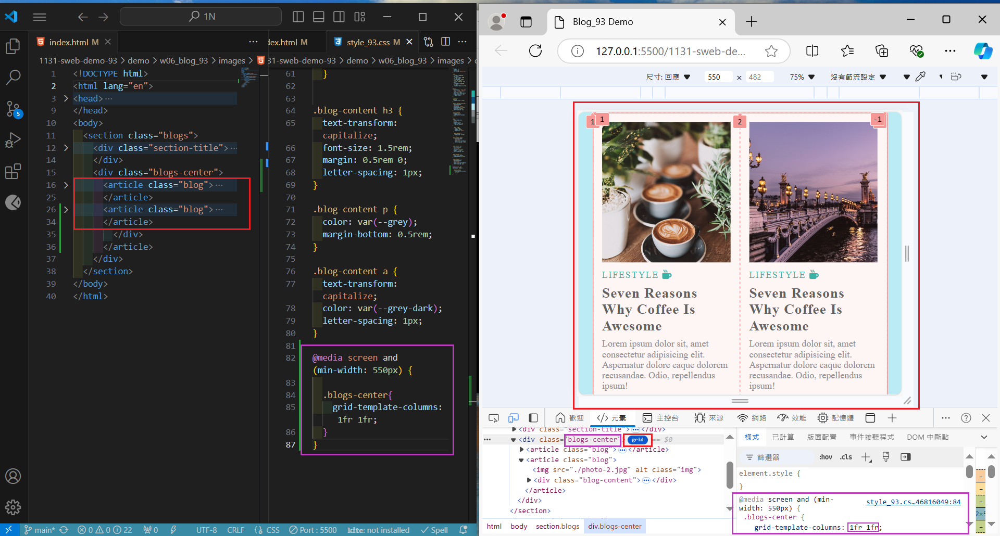
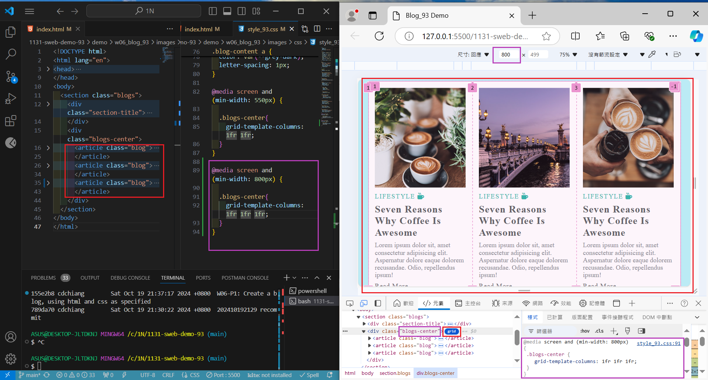
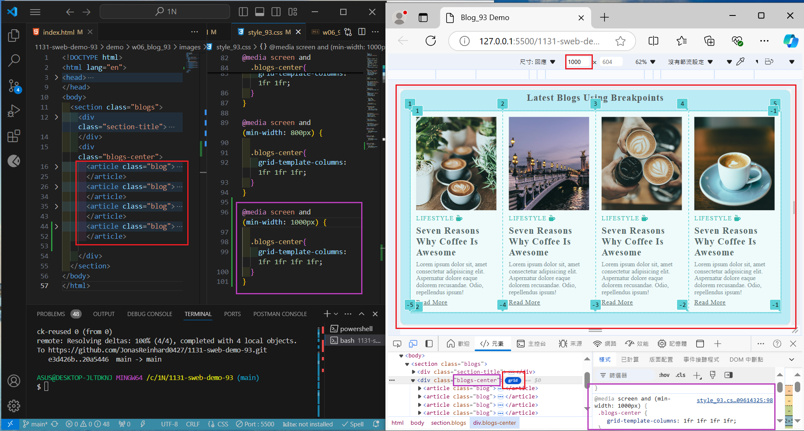
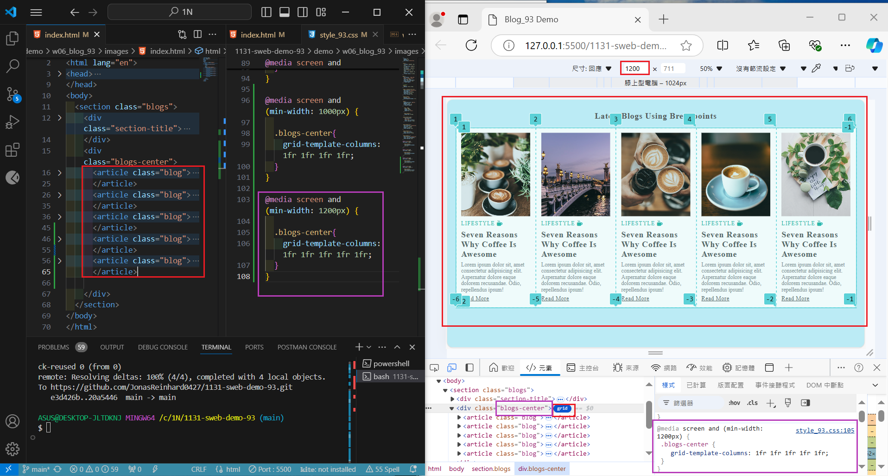
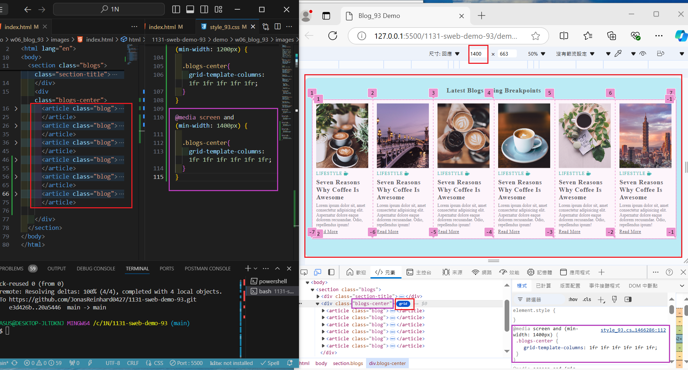
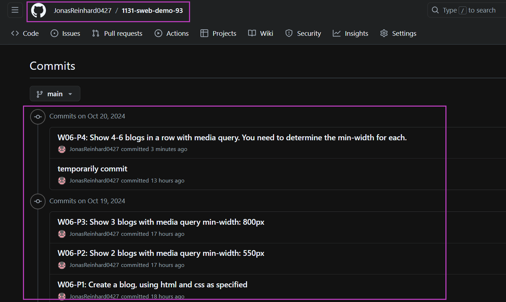

[My Github URL](https://github.com/JonasReinhard0427/1131-sweb-demo-93)


### W06-P1: Create a blog, using html and css as specified


```
155e2b8 cdchiang        Sat Oct 19 21:37:17 2024 +0800  W06-P1: Create a blog, using html and css as specified
```

### W06-P2: Show 2 blogs with media query min-width: 550px


```
d6daf0b cdchiang        Sat Oct 19 22:24:48 2024 +0800  W06-P2: Show 2 blogs with media query min-width: 550px
```

### W06-P3: Show 3 blogs with media query min-width: 800px


```
e3d426b cdchiang        Sat Oct 19 22:48:59 2024 +0800  W06-P3: Show 3 blogs with media query min-width: 800px
```

### W06-P4: Show 4-6 blogs in a row with media query. You need to determine the min-width for each.

### => 4 blogs in a row



### => 5 blogs in a row



### => 6 blogs in a row


```
e78672d cdchiang        Sun Oct 20 16:10:07 2024 +0800  W06-P4: Show 4-6 blogs in a row with media query. You need to determine the min-width for each.
```
### W06-P5: git logs of W6




